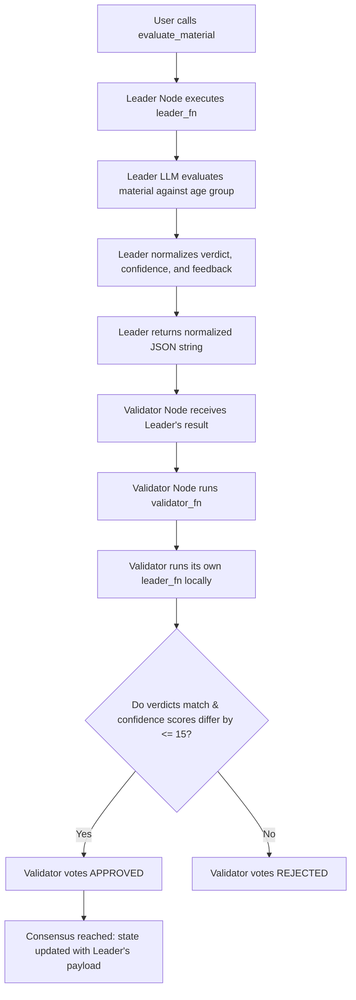

# Pedagogical Age-Appropriateness Oracle

A decentralized educational primitive built on GenLayer (v0.2.16).

When institutions mass-produce digital learning materials (such as video scripts, lesson plans, or math exercises), it is crucial to ensure the vocabulary, tone, and cognitive complexity are suitable for target student age groups. This primitive takes a `material_content` and a `target_age_group` (e.g. "Grade 4, 9-10 years old"). It uses a decentralized LLM jury acting as pedagogy experts to evaluate if the content is accessible, engaging, and age-appropriate, outputting a consensus-backed suitability verdict.

---

## 🌟 Reusable Educational Primitive (Beyond a "One-Off Demo")

This contract serves as an automated tagging and audit system for decentralized educational resource libraries:
1.  **Content Library Pre-screening:** Open-source educational registries can dynamically audit submitted resources before publishing, ensuring assets are correctly tagged by age group.
2.  **Adaptive Curriculum Builders:** Adaptive learning engines can query this oracle to dynamically adjust content difficulty levels for students based on their performance and age.
3.  **Parent & Teacher Portals:** Automatically warn teachers if a third-party learning asset drifts beyond a child's cognitive capacity, preventing frustration.

---

## 🏗️ Storage & State Design

The contract maintains state using GenLayer's persistent storage:
*   **`SuitabilityRecord` (Struct):** An `@allow_storage @dataclass` holding the material snippet, target age group, consensus verdict (`APPROPRIATE`, `NEEDS_ADJUSTMENT`, or `INAPPROPRIATE`), validator confidence score (`bigint`), and qualitative pedagogical feedback.
*   **`evaluations` (TreeMap):** A persistent lookup table mapped from `str(eval_id)` to `SuitabilityRecord`.
*   **`next_id` (bigint):** An auto-incrementing ID tracking the total number of evaluations recorded.

---

## 🤝 Custom Validator Consensus Logic

Pedagogical suitability is subjective. To ensure stability and resist bias, the contract uses a **Custom Validator** via `gl.vm.run_nondet_unsafe(leader_fn, validator_fn)`:



### Consensus Rules:
1.  **Normalization:** The LLM's suitability verdict is normalized into either `"APPROPRIATE"`, `"NEEDS_ADJUSTMENT"`, or `"INAPPROPRIATE"`. The confidence score is coerced to a `0..100` integer.
2.  **Verdict Category Equality:** The validator checks if its independent run yields the **exact same suitability verdict** (e.g., both agree it is `APPROPRIATE`).
3.  **Confidence Score Banding:** The validator checks if its confidence score is within an **absolute difference of 15 points** of the leader's score (`abs(leader_confidence - mine_confidence) <= 15`).
4.  **Feedback Text Exemption:** The validator **ignores** differences in the qualitative `feedback` string, preventing consensus failure due to harmless synonym variations in the generated explanation text.

---

## 🧪 Edge Case Testing Guidelines

You can test the contract using GenLayer Studio or CLI using the following scenarios:

### 1. Age-Appropriate Content (APPROPRIATE Path)
*   **Target Age Group:** "9-10 years old" (Grade 4)
*   **Material Snippet:** "In this lesson, we will learn how to add fractions with common denominators by drawing pie charts."
*   **Expected Result:** Verdict: `APPROPRIATE`, Confidence: `~90-100`, Feedback congratulating the visual explanation of fractions.

### 2. Under-aged Complexity Check (INAPPROPRIATE Path)
*   **Target Age Group:** "5-6 years old" (Kindergarten)
*   **Material Snippet:** "In this lesson, we will learn how to add fractions with common denominators by drawing pie charts."
*   **Expected Result:** Verdict: `INAPPROPRIATE` or `NEEDS_ADJUSTMENT`, Confidence: `~85-100`, Feedback pointing out that fractions are cognitively too advanced for kindergarten children.

### 3. Extremely Advanced Content (INAPPROPRIATE Path)
*   **Target Age Group:** "Grade 4, 9-10 years old"
*   **Material Snippet:** "Derive the Schrodinger equation under a particle-in-a-box model to compute energy eigenvalues."
*   **Expected Result:** Verdict: `INAPPROPRIATE`, Confidence: `~95-100`.

### 4. Edge Case: Empty Fields
*   **Inputs:** `material_snippet = ""` or `target_age_group = ""`
*   **Expected Result:** The contract throws a `UserError` immediately.

---

## 🌐 Deployment & Test Evidence

*   **Contract Address:** `[YOUR_DEPLOYED_CONTRACT_ADDRESS_HERE]`
*   **Network:** `studionet`

### Worked Example (Illustrative Example)

#### Example Call:
```python
contract.evaluate_material(
    material_snippet="In this lesson, we will learn how to add fractions with common denominators by drawing pie charts.",
    target_age_group="5-6 years old"
)
```

#### Expected Output (JSON from `get_evaluation` view):
```json
{
  "id": "0",
  "material_snippet": "In this lesson, we will learn how to add fractions with common denominators by drawing pie charts.",
  "target_age_group": "5-6 years old",
  "suitability": "INAPPROPRIATE",
  "confidence": 95,
  "feedback": "Fractions and division are cognitively too advanced for a 5-6 year old child. Focus on simple counting and shape recognition instead."
}
```
*Note: The feedback field is illustrative of the natural language response, while the verdict and confidence band represent the verified consensus values.*
